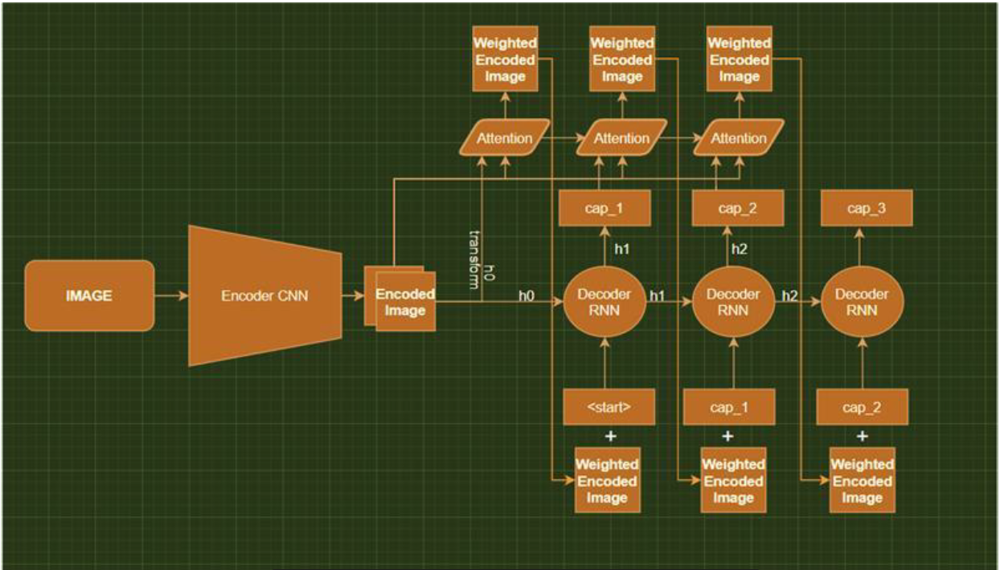
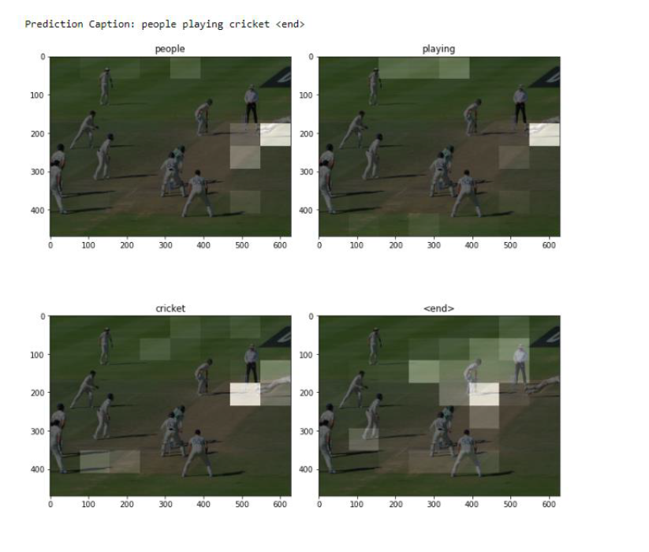

# Neural Image Caption Generator with Visual Attention 
 by **Ghanashyam R K P** in collaboration with Sharan Nagarajan, and Balamurugan.

This Project has been done as a part of the __Training and Internship__ Programme at **Indian Institute of Technology, Kanpur**, UP, India.

This Repository Contains a Jupyter Notebook **"Final-Notebook.ipynb"**, Which has the code for the whole *Deep Learning Pipeline* of the Implementation of Image Captioning.

It also contains a **Detailed Report** Named, **"Savvy_Captioners_Final_Report"**, which explains all the concepts implemented and at the end also contains the results of the project.

The **Encoder-Decoder Architecture** used in the project:

As a Team, We have also explained the project's concept and the code in brief by creating **Video and Hosted it on YouTube**. Watch It!

Some of the Interesting Results we obtained were -

Thank you! 
